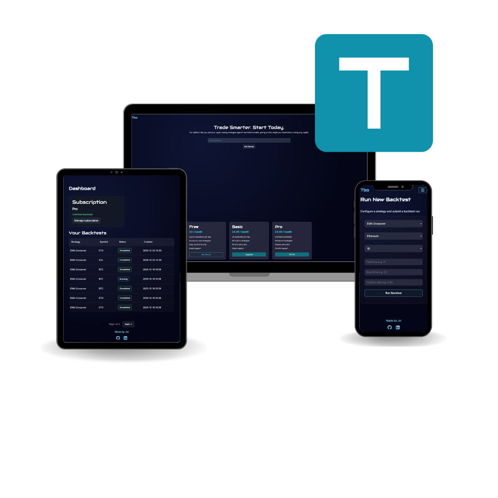

# Tbo

**[View live site](https://tbo-app-4663a8d1ae01.herokuapp.com/)**
## UX/UI
### Project Goals
The primary goal of Tbo is to provide a simple tool for users to test their crypto strategies. Users can input their strategy parameters and test them against real historical data from a selected coin.

Each backtest run the user starts with $10,000 and by the end they're able to see how well their strategy worked. They can see multiple result metrics like win rate, average return and exposure time.

At the moment the only supported strategy parameters are from the Exponential Moving Averages (EMA).
Future updates will support multiple strategy parameters from various technical analysis tools and other features like adding stop-losses.

Users must create an account and select a subscription plan to have access to these features. The current available plans are Free, Basic and Pro.

### Design Choices
**Fonts:**

Both main fonts were imported from Google fonts.
* Primary font: Inter
* Secondary font: Audiowide

**Colour palette:**

The colour palette was chosen from coolors.co and then adjusted for adequate contrast.

* Primary colour: #1092ad
* Secondary colour: #111827
* Highlight colour: #38BDF8
* Highlight colour light: #7DD3FC

### User Stories

**Viewing and Navigation**

1. As a shopper I can view a list of available subscriptions so that I can select one to purchase

2. As a shopper I can quickly identify deals and special offers to take advantage of special savings.

3. As a shopper I can easily view the total of my purchase at any time to avoid spending too much.

**Registration and User Account**

4. As a site user I can easily register for an account so that I can have a personal account and be able to view my profile.

5. As a site user I can easily login or logout so that I can access my personal account information.

6. As a site user I can easily recover my password in case I forget it so that I can recover access to my account.

**Logged in User**

7. As a logged in user I can input my strategy values so that I can test if my strategy idea is profitable.

8. As a logged in user I can see a list of past tests so that I can easily compare different backtest runs.

**Purchase and Checkout**

9. As a shopper I can select the type of membership to purchase so that I can ensure I don't accidentally select the wrong one.

10. As a shopper I can easily enter my payment information so that I can checkout quickly and with no hassle.

11. As a shopper I want to be able to feel that my personal and payment information is safe and secure so that I can confidently provide the needed info to make a purchase.

12. As a shopper I want to be able to view an order confirmation after checkout so that I can verify that I haven't made any mistakes.

## Features
### Existing Features
**User Authentication:**

Users can create an account and login to have access to the main functions. This way all the data is saved and filtered so the user can only see and modify what's theirs.

**Backtest Runs:**
Users can select a strategy, the required parameters and what coin to test their strategy against.
Each run you start with $10,000 and after each test you can see how well your strategy worked.

**EMA Backtest Runs:**

At the moment the only strategy supported by the app is using the Exponential Moving Averages cross as buying and selling signals. You can adjust the value of these per test.

### Getting Started
Getting started is very simple, you only need to follow these two steps:
* Create an account in the signup page.
* Select a subscription plan for your account.

You can now start logging your backtest runs in the backtest page. Test different parameters
and compare the results of each run in the dashboard page.

## Technologies Used
**Framework:** Django.  
**Front-end:** JavaScript, CSS, HTML and Bootstrap.  
**Back-end:** Python and PostgreSQL database.  
**Version Control:** Git & GitHub.  
**Deployment:** The site is deployed on Heroku.

## Database ERD

## Testing
### Manual Testing
All forms were manually tested for:
* Correct value input (email, name, numbers…).
* Submit buttons working.
* Feedback when submitted properly.
* Warnings before deleting any data. 

All internal links were checked.  
All social links were checked.

### Automatic Testing
#### TDD
Asserts were used on the main functions of the app.

#### W3C Markup Validation
All pages were tested with W3C markup validator with no major errors.

#### W3C CSS Validation
This tested with no errors.

#### JSLint
All JS documents were tested with no major errors.

#### PEP8
All Python documents were tested to meet pep8 standards.  

#### Google Lighthouse
All pages were tested with Lighthouse for performance, accessibility and best practices. The app consistently scored over 90, 95 and 100 respectively.  

## Credits
The colour palette was chosen from [coolors.co](https://coolors.co/).  
The fonts were imported from [Google fonts](https://fonts.google.com/).  
All icons were imported from [fontawesome.com](https://fontawesome.com/).  
The favicon was created with [favicon.io](https://favicon.io/).  